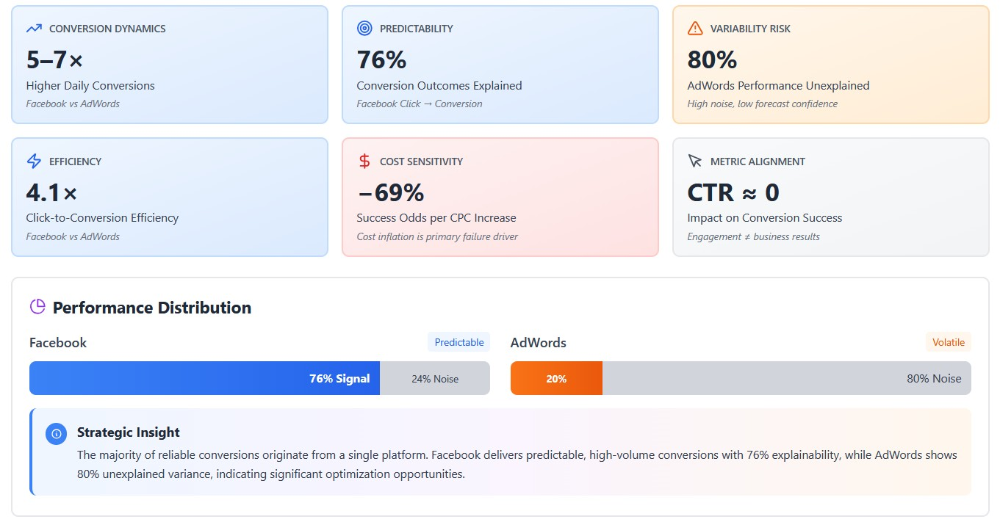

# Executive Brief: Advertising Budget Reallocation

# Digital Advertising Optimization  
## Executive Summary

### 🎯 TL;DR

- Facebook delivers **~4× higher conversion efficiency per click** than AdWords (≈21% vs ≈5%)
- Strong evidence supports **reallocating budget toward Facebook**, with a recommended **75/25 split**
- **Expected outcome:** ~26% increase in conversions, improved cost efficiency, and higher forecast reliability under current performance conditions

## Business Context

Over a 365-day period, daily advertising spend was allocated across Facebook Ads and Google AdWords.  
The core objective was to determine **how to maximize conversions while maintaining cost discipline**.

Rather than focusing solely on volume, the analysis emphasized:
- Efficiency  
- Consistency  
- Predictability  

**North Star Metric:**  
**Cost per Conversion**, linking spend directly to measurable business outcomes.

## Analytical Scope

- 365 days of paired daily campaign data  
- Platforms analyzed: Facebook Ads and Google AdWords  
- Metrics evaluated:
  - Impressions  
  - Clicks  
  - Conversions  
  - Total cost  
  - CTR  
  - Conversion rate  
  - Cost per click (CPC)  
- Methods applied:
  - Paired t-tests  
  - Effect size (Cohen’s d)  
  - Linear and logistic regression  
  - Cointegration testing  

## Key Insights

### 📊 Relative Performance

- Facebook consistently generates **5–7× higher daily conversions** than AdWords (≈35–50 vs ≈4–9)
- The performance gap is **persistent across identical days**, not driven by seasonality or isolated spikes

### 📊 Conversion Efficiency & Predictability

- Facebook converts clicks at **~4.1× the efficiency** of AdWords  
  - ≈21% vs ≈5% click-to-conversion rate  
- Strong click-to-conversion relationship on Facebook:
  - Correlation = **0.87**
  - Linear model explains **76%** of conversion variance (R² = 0.76)
- AdWords shows limited predictability:
  - Correlation = **0.45**
  - Only **20%** of variance explained (R² = 0.20)

**Implication:**  
Facebook supports reliable forecasting and scalable growth within observed spend ranges, while AdWords performance remains inconsistent and difficult to predict.

### 📊 Statistical Confidence

- Paired t-test (same-day comparison) confirms Facebook’s superiority:
  - T-statistic = **33.10**
  - P-value = **8.36 × 10⁻¹¹²**
- Effect size:
  - **Cohen’s d = 1.73** (“Very Large”)

**Interpretation:**  
The difference is both **statistically robust** and **materially meaningful**, with a substantial and consistent advantage favoring Facebook.

### 📊 Cost Dynamics & Optimization Drivers

- Logistic regression (Facebook campaigns) indicates:
  - **Click volume** is the strongest positive success driver (+22.8% odds per click)
  - **CPC** is the strongest negative driver (−69.3% odds per unit increase)
  - **CTR has minimal standalone impact**, reinforcing its role as a secondary metric

**Implication:**  
Cost-efficient volume, not headline CTR, drives sustainable performance.

### 📊 Long-Term Reliability

- Cointegration analysis confirms a **stable long-term relationship** between Facebook ad spend and conversions (p < 0.0001)
- This indicates that spend and outcomes move together over time, supporting:
  - Budget planning
  - Controlled scaling
  - Reliable optimization feedback loops

## Strategic Recommendation

### Budget Allocation

- Shift toward a **Facebook-weighted allocation (≈75%)**, while retaining **AdWords (≈25%)** for supplemental or brand-driven demand
- This mix balances:
  - Higher conversion efficiency
  - Stronger predictability
  - Reduced dependence on volatile or low-intent traffic

## Expected Impact (Directionally)

- ~26% increase in total conversions based on historical performance patterns  
- Improved cost efficiency driven by higher conversion rates and lower sensitivity to CPC  
- Meaningfully higher forecast accuracy due to Facebook’s stronger explanatory power  

*All projections assume current CPC levels and observed conversion dynamics remain broadly stable.*

## Closing Note

The analysis indicates that **platform choice is a primary driver of conversion outcomes**.  
Facebook demonstrates a durable advantage in efficiency, consistency, and predictability, making it the preferred channel for scaled investment under current conditions.
